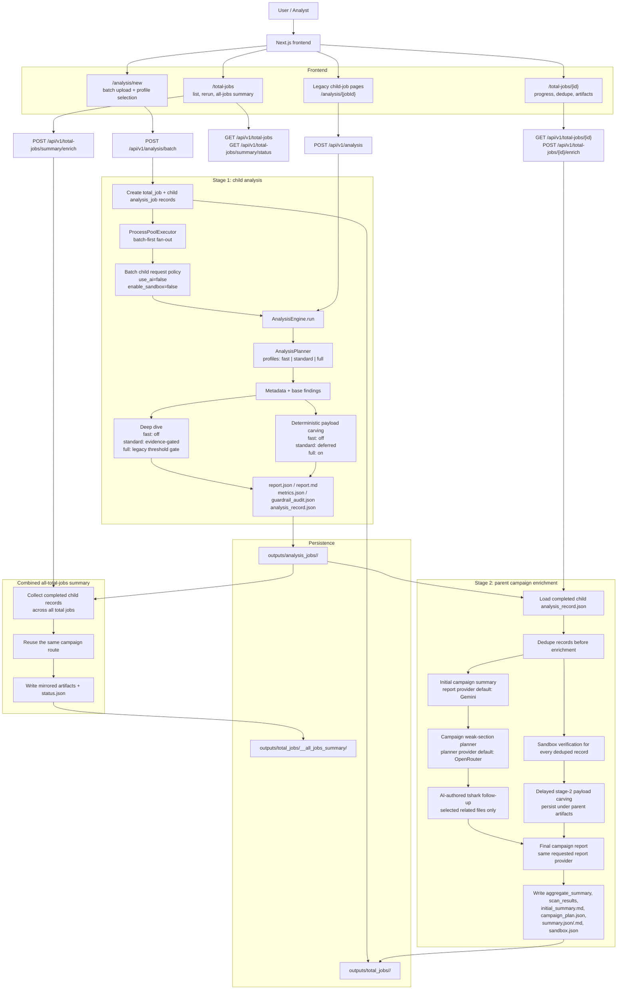

# AgenticNetSec Architecture

## Overview

AgenticNetSec currently supports two live execution paths:

1. Legacy single-file analysis
- `POST /api/v1/analysis`
- accepts one uploaded PCAP or one `pcap_path`
- runs `AnalysisEngine` directly
- can still use optional AI and sandbox behavior on that single-file path

2. Batch-first total-job analysis
- `POST /api/v1/analysis/batch`
- accepts one or more uploaded PCAPs or JSON `pcap_paths`
- creates one parent `total_job`
- creates one child `analysis_job` per file
- runs deterministic stage 1 first
- defers parent-level AI and sandbox enrichment to an explicit stage 2 trigger

The current product direction is total-job-first:

- stage 1 is deterministic and batch-friendly
- stage 2 is deliberate and parent-scoped
- large corpora can also be summarized through one combined all-total-jobs route

## Current Execution Model

### Stage 1: deterministic child analysis

Each child `analysis_job` produces the usual analyst artifacts plus a flattened `analysis_record.json` for later aggregation.

For the batch path, child requests are intentionally forced to:

- `use_ai = false`
- `enable_sandbox = false`

This keeps initial batch execution cheaper, more predictable, and easier to scale.

### Stage 2: parent enrichment

Parent enrichment is triggered later through:

- `POST /api/v1/total-jobs/{total_job_id}/enrich`

The live enrichment route is:

1. initial AI campaign summary
2. campaign weak-section planning
3. sandbox verification over deduplicated child records
4. targeted AI-authored `tshark` follow-up for selected files
5. delayed stage-2 payload carving when the evidence warrants it
6. final AI report over enriched records

### All-total-jobs summary

The `/total-jobs` page also supports one combined summary across completed child jobs from all total jobs through:

- `GET /api/v1/total-jobs/summary/status`
- `POST /api/v1/total-jobs/summary/enrich`
- `GET /api/v1/total-jobs/summary/json`
- `GET /api/v1/total-jobs/summary/markdown`
- `GET /api/v1/total-jobs/summary/sandbox`

That combined path reuses the same campaign route as per-total-job enrichment, but writes into:

- `outputs/total_jobs/__all_jobs_summary/`

## Current Code Structure

### Frontend

The live frontend is a Next.js App Router application under `frontend/`.

Relevant routes:

- `frontend/app/analysis/new/page.tsx`
  - batch-first submission UI
  - supports multi-file uploads
  - sends `worker_count`
  - sends `analysis_profile`
- `frontend/app/total-jobs/page.tsx`
  - total-job list
  - rerun/retry enrichment actions
  - combined all-total-jobs summary controls and artifacts
- `frontend/app/total-jobs/[totalJobId]/page.tsx`
  - single parent batch detail
  - deterministic progress
  - enrichment progress
  - dedupe visibility
  - summary and sandbox artifact display
- `frontend/app/analysis/[jobId]/page.tsx`
  - legacy single-child drill-down still exists

Relevant frontend support modules:

- `frontend/lib/api/analysis.ts`
- `frontend/lib/transport/analysis.ts`
- `frontend/lib/adapters/analysis.ts`
- `frontend/hooks/use-total-jobs.ts`
- `frontend/hooks/use-total-job-status.ts`

### Backend API Layer

- `backend/api/app.py`
  - FastAPI entrypoint
  - child-job routes
  - total-job routes
  - all-total-jobs summary routes
  - background orchestration
- `backend/api/job_store.py`
  - persisted child-job state under `outputs/analysis_jobs/`
- `backend/api/total_job_store.py`
  - persisted parent total-job state under `outputs/total_jobs/`

### Backend Analysis Core

- `backend/src/analysis_engine.py`
  - orchestrates stage 1
  - persists `analysis_record.json`
- `backend/src/planner.py`
  - resolves `fast`, `standard`, and `full`
  - controls deep dive and deterministic payload carving behavior
- `backend/src/analyzer.py`
  - summary and metadata extraction
- `backend/src/detectors.py`
  - deterministic network findings
- `backend/src/deep_dive.py`
  - evidence-heavy deeper interpretation when enabled
- `backend/src/payload_carver.py`
  - deterministic payload carving
  - used in `full` stage 1 and again in stage 2 enrichment
- `backend/src/sandbox_verifier.py`
  - bounded `tshark` verification
- `backend/src/ai_tshark_planner.py`
  - campaign weak-section planning
  - file selection for follow-up
  - per-file AI-authored `tshark` query generation
- `backend/src/report_ai.py`
  - structured report generation
  - deterministic fallback rendering
  - aggregate campaign reporting

### Backend Enrichment Orchestration

- `backend/scripts/enrich_results_with_sandbox.py`
  - owns the live campaign route used by the API
  - runs:
    - initial summary
    - planner
    - sandbox verification
    - optional AI `tshark`
    - stage-2 payload carving
    - final report
- `backend/scripts/summarize_results.py`
  - aggregate signal builder reused by the API

## Current Mermaid Diagram

## Main Runtime Flow

### 1. Single-file path

The single-file API remains available for direct per-PCAP analysis:

- `POST /api/v1/analysis`

It still runs the same `AnalysisEngine`, but it is no longer the primary product path.

### 2. Batch stage 1

The primary entrypoint is:

- `POST /api/v1/analysis/batch`

This path:

1. validates files or JSON `pcap_paths`
2. normalizes `analysis_profile`
3. creates one parent `total_job`
4. creates one child `analysis_job` per file
5. fans out child work through a `ProcessPoolExecutor`
6. updates parent progress as child jobs advance

The parent is considered ready for stage 2 when deterministic child processing is complete.

### 3. Child analysis pipeline

Each child job runs through `AnalysisEngine.run()` and persists:

- `report.json`
- `report.md`
- `metrics.json`
- `guardrail_audit.json`
- `analysis_record.json`

The `analysis_record.json` artifact is the stable bridge into parent enrichment.

### 4. Stage 1 profiles

The live planner behavior is:

- `fast`
  - lightweight metadata
  - deterministic only
  - skips deep dive
  - skips deterministic payload carving
- `standard`
  - default profile
  - lightweight metadata
  - deterministic only
  - deep dive runs only after suspicious base findings are present
  - deterministic payload carving is skipped entirely
  - payload-deployment follow-up is deferred to stage 2 enrichment
- `full`
  - heavier deterministic path
  - full metadata extraction
  - deterministic payload carving always runs
  - deep dive keeps the legacy size and packet threshold gate

### 5. Parent enrichment route

The parent enrichment route in `backend/scripts/enrich_results_with_sandbox.py` is now the live stage-2 backend flow.

For one total job it:

1. loads completed child `analysis_record.json` files
2. deduplicates repeated records before AI and sandbox
3. creates an initial campaign summary
4. asks the campaign planner which ABCD sections are weak
5. selects related files for targeted follow-up
6. runs sandbox verification across every deduplicated record
7. runs AI-authored `tshark` follow-up only for selected files
8. runs delayed payload carving when stage-1 findings, sandbox evidence, or weak `D` justify it
9. builds a final aggregate summary
10. renders the final campaign report

The live route signature intentionally splits providers:

- report provider defaults to `gemini`
- planner provider defaults to `openrouter`

### 6. Stage-2 delayed payload carving

Payload carving is no longer only a stage-1 concern.

During parent enrichment:

- `backend/scripts/enrich_results_with_sandbox.py` may call `run_payload_carving()`
- the enriched record gains:
  - `payload_carving_status`
  - `payload_iocs`
  - `carved_payloads`
  - `payload_carving_manifest_path`
  - `payload_carving_stage = "stage2_sandbox_enrichment"`
- carving artifacts are persisted under the parent artifact folder, not the child folder

This keeps normal `standard` stage-1 runs fast while still letting stage 2 improve payload-deployment evidence when needed.

### 7. All-total-jobs summary route

The all-jobs summary route uses the same campaign flow as a per-total-job enrichment run, but its source set is:

- all completed child jobs across all total jobs

It persists into:

- `outputs/total_jobs/__all_jobs_summary/`

and tracks progress separately in:

- `outputs/total_jobs/__all_jobs_summary/status.json`

## Current API Surface

### Child-job APIs

- `POST /api/v1/analysis`
- `GET /api/v1/analysis`
- `GET /api/v1/analysis/{job_id}`
- `GET /api/v1/analysis/{job_id}/report.json`
- `GET /api/v1/analysis/{job_id}/report.md`
- `GET /api/v1/analysis/{job_id}/metrics`
- `GET /api/v1/analysis/{job_id}/guardrail-audit`

### Total-job APIs

- `POST /api/v1/analysis/batch`
- `GET /api/v1/total-jobs`
- `GET /api/v1/total-jobs/{total_job_id}`
- `POST /api/v1/total-jobs/{total_job_id}/enrich`
- `GET /api/v1/total-jobs/{total_job_id}/summary.json`
- `GET /api/v1/total-jobs/{total_job_id}/summary.md`
- `GET /api/v1/total-jobs/{total_job_id}/sandbox`

### All-total-jobs summary APIs

- `GET /api/v1/total-jobs/summary/status`
- `POST /api/v1/total-jobs/summary/enrich`
- `GET /api/v1/total-jobs/summary/json`
- `GET /api/v1/total-jobs/summary/markdown`
- `GET /api/v1/total-jobs/summary/sandbox`

## Storage Model

### Child-job artifacts

Stored in:

- `outputs/analysis_jobs/<analysis_job_id>/`

Common files:

- `job.json`
- `report.json`
- `report.md`
- `metrics.json`
- `guardrail_audit.json`
- `analysis_record.json`

### Total-job artifacts

Stored in:

- `outputs/total_jobs/<total_job_id>/`

Common files after enrichment:

- `total_job.json`
- `aggregate_summary.json`
- `scan_results.json`
- `scan_results.jsonl`
- `scan_results.ai-tshark.jsonl`
- `initial_summary.md`
- `campaign_plan.json`
- `summary.json`
- `summary.md`
- `sandbox.json`
- `sandbox-payload-carving/...`

### All-total-jobs summary artifacts

Stored in:

- `outputs/total_jobs/__all_jobs_summary/`

Common files:

- `status.json`
- `aggregate_summary.json`
- `scan_results.json`
- `scan_results.jsonl`
- `scan_results.ai-tshark.jsonl`
- `initial_summary.md`
- `campaign_plan.json`
- `summary.json`
- `summary.md`
- `sandbox.json`
- `sandbox-payload-carving/...`

### Offline result artifacts

Older script-oriented outputs still exist and are still useful for some manual workflows:

- `outputs/scan_results.jsonl`
- `outputs/scan_results.ai-tshark.jsonl`
- `outputs/aggregate_summary.json`
- `outputs/incident_report.md`

## Provider and Execution Boundaries

### Deterministic stage 1 is allowed to

- parse PCAPs locally
- run rule-based analysis
- build deterministic artifacts
- persist analysis records for later aggregation

### Batch stage 1 does not do

- AI summary generation
- sandbox verification
- delayed parent-level enrichment

### Parent enrichment is allowed to

- read child analysis artifacts
- dedupe repeated records
- generate campaign-level summaries
- run bounded sandbox verification
- run targeted AI-authored `tshark` follow-up
- run delayed payload carving inside parent artifact boundaries

### Provider behavior

Environment variables override `backend/config/local_settings.py`.

Current intended split for the campaign route is:

- Gemini for initial campaign summary and final report
- OpenRouter for campaign planning and targeted `tshark` follow-up

Report generation now respects the requested provider for that report path. If a requested report provider is unavailable, the system falls back to deterministic report text instead of silently switching to another provider.

### Sandbox behavior

The sandbox path is limited to bounded `tshark` verification and compact structured outputs. It is not a general command-execution path for AI.

## Current Limitations

- The repo still supports both the legacy single-file path and the newer total-job-first path, so the system is intentionally in an overlap phase.
- Some older docs and helper scripts still describe the previous offline-summary-first mental model.
- Detection logic still has historical bias toward certain ingress or lateral-movement shapes and may need more balancing for WinRM or VPN-heavy incidents.
- The frontend is now functionally total-job aware, but it still retains legacy child-job pages for drill-down and compatibility.

## Recommended Near-Term Direction

1. Keep total-job pages as the primary UX.
2. Keep child-job pages as drill-down views only.
3. Continue treating `analysis_record.json` as the stable handoff from deterministic stage 1 to enrichment stage 2.
4. Keep parent enrichment explicit and operator-triggered.
5. Continue consolidating duplicated script and API orchestration around the campaign route rather than maintaining parallel flow descriptions.
